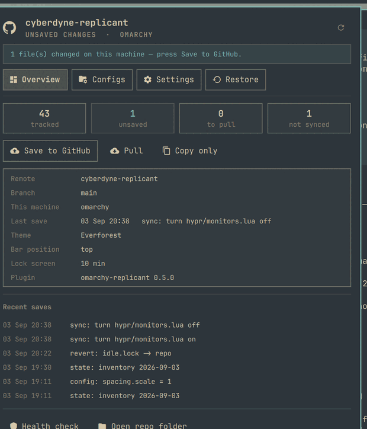
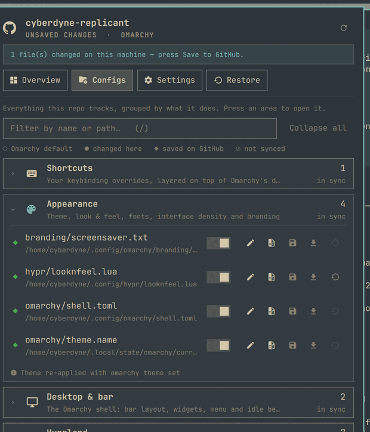
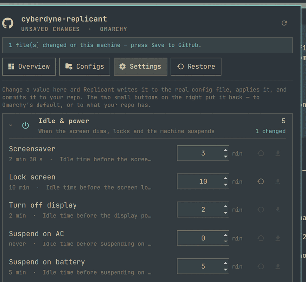

# Omarchy Replicant

**The right way to back up [Omarchy](https://omarchy.org/).**

Not a dotfile copier. Replicant knows *how Omarchy works* — so it saves the things Omarchy
actually keeps your setup in, and puts them back the way Omarchy expects: the theme is re-applied
with `omarchy theme set`, Hyprland gets a real `hyprctl reload`, terminals are restarted, missing
plugins are reinstalled with `omarchy plugin add`. Everything lands in **a private GitHub repo of
your own**.

```bash
omarchy plugin add https://github.com/tymurbogach/omarchy-replicant --enable --yes
```

A GitHub mark appears in the bar. Click it, press **Create private repo**, and you are done — it makes
the repo, copies your configs and secrets in, and pushes. Nothing else to install or configure.

<p align="center">
  
  &nbsp;
  
  &nbsp;
  
</p>

## Why "the right way"

A backup that copies files back is only half a restore. Omarchy holds a machine's identity in more
than files, and each part has one correct way to be put back:

| | The wrong way | What Replicant does |
| --- | --- | --- |
| **Theme** | copy `theme.name` into place | replays `omarchy theme set`, which rewrites every terminal, editor, GTK and Plymouth colour |
| **Hyprland** | copy the Lua and hope | copies, then `hyprctl reload` **and** checks `hyprctl configerrors` |
| **Terminals** | copy and wait for a reboot | copies, then `omarchy restart terminal` |
| **Plugins** | commit someone else's source into your repo | records each plugin's id and git origin, reinstalls with `omarchy plugin add` |
| **Shortcuts** | snapshot all 227 active bindings | tracks only *your* overrides in `hypr/bindings.lua` — the defaults come with the distro and change with it |
| **Defaults** | diff every file forever | knows which files are byte-identical to Omarchy's, and leaves them alone |
| **Reset** | `rm` and re-copy | `omarchy refresh config <file>`, the command Omarchy ships for exactly this |

The panel tells you which one it will use before you press anything.

## What you get

- **Four tabs, everything collapsed.** Configs groups 43 tracked files into eleven areas —
  Shortcuts, Appearance, Desktop & bar, Hyprland, Terminal, Development, Secrets & keys, Plugins,
  Scripts, System. You open the one you came for; there is no long scroll.
- **21 settings you can change from the panel**, in units a person uses: the lock screen is
  *10 min*, not *600*. Each writes to the real config file, applies it, and commits it.
- **Two ways back for every single value** — one button to Omarchy's default, one to what your
  repo has, without touching the rest of the file it lives in.
- **A switch per file.** Running a desktop *and* a laptop off one repo? `hypr/monitors.lua`
  describes the screens plugged into *this* box; switch it off and it stops travelling. The
  decision is stored in the repo, so both machines honour it.
- **Machine-scoped inventory.** Packages, services and plugins are recorded per hostname, so two
  machines add to the repo instead of overwriting each other.
- **Secrets that stay secret.** SSH keys, tokens and `.env` files are backed up at mode 600 — and
  the panel shows a kind, a mode and a variable *count*. No value is ever drawn on screen, and the
  inline diff refuses to render one.
- **A badge per file**: ○ untouched Omarchy default · ● changed here · ◆ saved on GitHub ·
  ⊘ not synced.
- **No terminal pop-ups.** Editing opens your editor. Diffs render in the panel. Destructive
  actions ask once, in the panel.

## Second machine

```bash
omarchy plugin add https://github.com/tymurbogach/omarchy-replicant --enable --yes
~/.config/omarchy/plugins/io.github.tymurbogach.omarchy-replicant/bin/omarchy-replicant clone https://github.com/<you>/<hostname>-replicant
```

Then open the panel → **Restore** → *Preview*, and if it looks right, *Restore everything* — or
just one area at a time.

## What it backs up

| | |
| --- | --- |
| `config/` | An explicit list of dotfiles: shell, ssh, git, every Hyprland config including your keybindings, terminals, Claude/opencode, VS Code, mise, Omarchy's `shell.json` / `shell.toml` / menu, your theme and default editor, plus systemd drop-ins under `/etc`. |
| `config/plugins/` | Auto-detected: any Omarchy plugin keeping its settings in `~/.config/omarchy/<plugin>.json`. |
| `secrets/` | SSH keys, tokens, `.env` files. Mode `600`, and a pre-commit hook blocks the commit if anything credential-shaped leaks outside this folder. |
| `state/<hostname>/` | That machine's packages, enabled services, containers, installed plugins with their git origins, and its drift from Omarchy's defaults. |

Your data repo is **private and yours**. This repo is only the plugin's code — the two never mix.

## Safety

Everything that writes to your system is **dry-run by default** and previews first. Every file it
overwrites is copied to `<file>.bak.<epoch>`, keeping the three most recent. Reset is only offered
for files Omarchy ships a default for. A Hyprland key that is ambiguous is left alone rather than
guessed at. Anything outside `$HOME` is never written silently — you get the exact `sudo` command
instead. Concurrent operations are serialized, so a burst of clicks cannot corrupt the repo.

## Clean install, clean removal

The plugin writes nothing outside its own folder and `~/.local/share/omarchy-replicant/` (your
backup repo). It does not put itself on your `PATH` — the panel calls its own CLI directly.

`purge` lives inside the plugin, so run it **before** removing the plugin itself:

```bash
P=~/.config/omarchy/plugins/io.github.tymurbogach.omarchy-replicant
$P/bin/omarchy-replicant purge                 # show what is on disk — changes nothing
$P/bin/omarchy-replicant purge --apply --repo  # remove it, local clone included
omarchy plugin remove io.github.tymurbogach.omarchy-replicant
```

Leave off `--repo` to keep your local backup clone. Either way your GitHub repo is untouched.

## Opening the panel from a key

```lua
-- ~/.config/hypr/bindings.lua
o.bind("SUPER + SHIFT + B", "Replicant", "omarchy shell replicant toggle")
```

## Command line (optional)

The panel does everything; the CLI is there if you prefer it.

```bash
~/.config/omarchy/plugins/io.github.tymurbogach.omarchy-replicant/bin/omarchy-replicant link
omarchy-replicant --help
```

`link` adds it to `~/.local/bin`; `unlink` removes it again.

```
status [--json]      savegame [-m "why"]   settings [--json]
get <id>             set <id> <value>      revert <id> [--to default|repo]
edit <id>            diff <id>             path <id>
save-file <id>       restore-file <id>     sync <id> on|off
shortcuts [--json]   log [-n N]            doctor
reset <id> | reset-all                     restore [--apply --all] [--only <area>]
clone <url>          link | unlink         purge [--apply] [--repo]
```

`doctor` answers the questions worth checking: am I logged in, is my repo actually private, is the
secret scan on, are the permissions right.

## Docs

- [First-time setup](docs/getting-started.md)
- [Notes for contributors](CLAUDE.md) — the traps this plugin has actually hit, and why the code
  is shaped the way it is.

```bash
./tests/run-all.sh    # 320 checks, plus shellcheck, qmllint and the manifest validator
```

MIT licensed.
