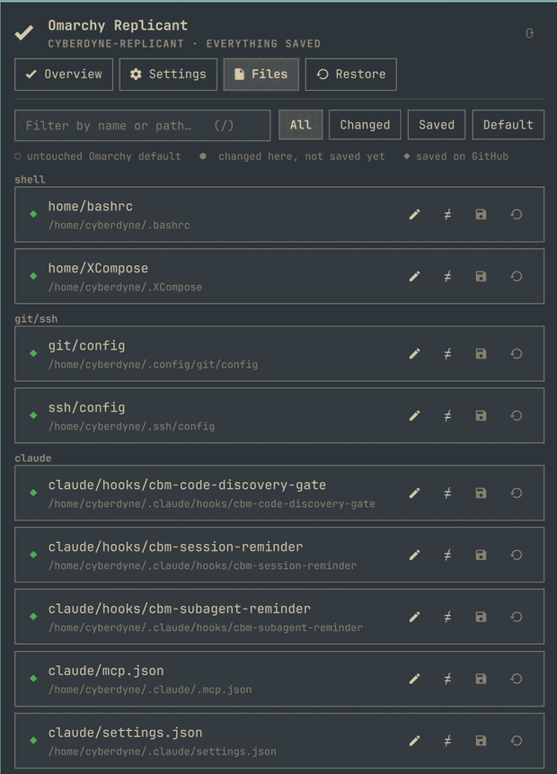

# Omarchy Replicant

Back up your [Omarchy](https://omarchy.org/) machine to a **private GitHub repo of your own**,
restore it on another machine, and change the settings you actually change — from the bar.

```bash
omarchy plugin add https://github.com/tymurbogach/omarchy-replicant --enable --yes
```

An **R** appears in the bar. Click it, press **Create private repo**, and you are done — it makes
the repo, copies your configs and secrets in, and pushes. Nothing else to install or configure.

<p align="center">
  
  &nbsp;
  
  &nbsp;
  
</p>

## What you get

- **One panel, four tabs.** Overview tells you what to do next in one sentence. Settings changes
  values for real. Files shows everything being backed up. Restore is the way back.
- **19 settings you can change from the panel** — screensaver, lock, suspend, theme, bar position
  and thickness, font size, interface density, keyboard layout, key repeat, touchpad, default
  editor. Each one is written to the real config file, applied, and committed to your repo.
- **A badge per file**: ○ untouched Omarchy default · ● changed here · ◆ saved on GitHub.
- **No terminal pop-ups.** Editing opens your editor. Diffs render in the panel. Destructive
  actions ask once, in the panel.
- **A second machine in three commands** — clone, preview, apply.

## Second machine

```bash
omarchy plugin add https://github.com/tymurbogach/omarchy-replicant --enable --yes
~/.config/omarchy/plugins/io.github.tymurbogach.omarchy-replicant/bin/omarchy-replicant clone https://github.com/<you>/<hostname>-replicant
```

Then open the panel → **Restore** → *Preview*, and if it looks right, *Restore everything*.

## What it backs up

| | |
| --- | --- |
| `config/` | An explicit list of dotfiles: shell, ssh, git, Hyprland, terminals, Claude/opencode, VS Code, mise, Omarchy's `shell.json` / `shell.toml`, your theme and default editor, plus systemd drop-ins under `/etc`. |
| `config/plugins/` | Auto-detected: any Omarchy plugin keeping its settings in `~/.config/omarchy/<plugin>.json`. |
| `secrets/` | SSH keys, tokens, `.env` files. Mode `600`, and a pre-commit hook blocks the commit if anything credential-shaped leaks outside this folder. |
| `state/` | Packages, enabled services, containers, installed plugins with their git origins, and your drift from Omarchy's defaults. |

Your data repo is **private and yours**. This repo is only the plugin's code — the two never mix.

## Safety

Everything that writes to your system is **dry-run by default** and previews first. Every file it
overwrites is copied to `<file>.bak.<epoch>`, keeping the three most recent. Reset is only offered
for files Omarchy ships a default for. A Hyprland key that is ambiguous is left alone rather than
guessed at. Concurrent operations are serialized, so a burst of clicks cannot corrupt the repo.

## Clean install, clean removal

The plugin writes nothing outside its own folder and `~/.local/share/omarchy-replicant/` (your
backup repo). It does not put itself on your `PATH` — the panel calls its own CLI directly.

`purge` lives inside the plugin, so run it **before** removing the plugin itself:

```bash
P=~/.config/omarchy/plugins/io.github.tymurbogach.omarchy-replicant
$P/bin/omarchy-replicant purge                 # show what is on disk — changes nothing
$P/bin/omarchy-replicant purge --apply --repo  # remove it, local clone included
omarchy plugin remove io.github.tymurbogach.omarchy-replicant
```

Leave off `--repo` to keep your local backup clone. Either way your GitHub repo is untouched.

## Command line (optional)

The panel does everything; the CLI is there if you prefer it.

```bash
~/.config/omarchy/plugins/io.github.tymurbogach.omarchy-replicant/bin/omarchy-replicant link
omarchy-replicant --help
```

`link` adds it to `~/.local/bin`; `unlink` removes it again.

```
status [--json]      savegame [-m "why"]   settings [--json]
get <id>             set <id> <value>      save-file <id>
edit <id>            diff <id>             path <id>
log [-n N]           doctor                reset <id> | reset-all
restore [--apply --all]                    clone <url>
link | unlink        purge [--apply] [--repo]
```

`doctor` answers the questions worth checking: am I logged in, is my repo actually private, is the
secret scan on, are the permissions right.

## Docs

- [First-time setup](docs/getting-started.md)
- [Notes for contributors](CLAUDE.md) — the traps this plugin has actually hit, and why the code
  is shaped the way it is.

```bash
./tests/run-all.sh    # 196 checks, plus shellcheck, qmllint and the manifest validator
```

MIT licensed.
