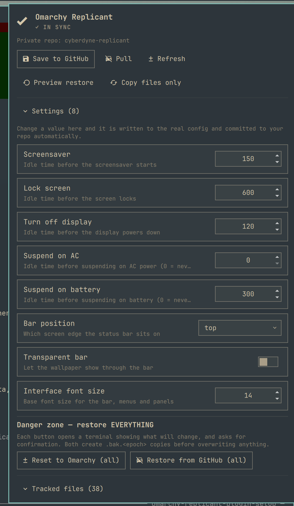
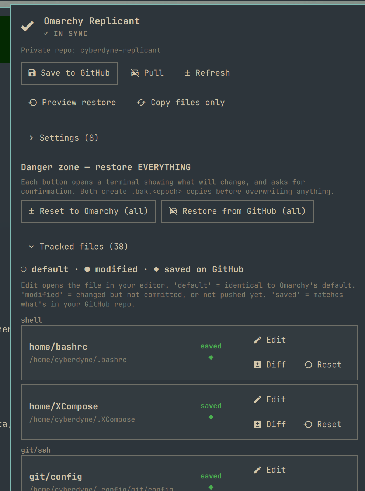

# Omarchy Replicant (`io.github.tymurbogach.omarchy-replicant`)

A bar widget for [Omarchy](https://omarchy.org/) that backs your configuration up to **your own
private GitHub repo**, restores it on another machine, and lets you change common settings
straight from the panel.

<p align="center">
  
  &nbsp;
  
</p>

Click the **R** in the bar. You get one panel with three things:

- **Actions** — save this machine to GitHub, pull what another machine saved, preview a restore.
- **Settings** — screensaver, lock, display-off, suspend, bar position, transparency, font size.
  Change a value and it is written to the real config file *and* committed to your repo.
- **Tracked files** — every file being backed up, each showing whether it is untouched, changed,
  or already saved on GitHub, with per-file Edit / Diff / Reset.

## Install

```bash
omarchy plugin add https://github.com/tymurbogach/omarchy-replicant --enable --yes
```

Then set up your private repo (see [GETTING-STARTED.md](GETTING-STARTED.md)):

```bash
omarchy-replicant login            # gh auth, once
omarchy-replicant create --push    # creates <hostname>-replicant, private, and pushes
```

On a second machine, point it at the repo you already have:

```bash
omarchy-replicant clone https://github.com/<you>/<hostname>-replicant
omarchy-replicant restore --dry-run    # see what would change
omarchy-replicant restore --apply --all
```

## What it tracks

- **`config/`** — a fixed, explicit list of dotfiles: shell, ssh, git, Hyprland Lua, terminals,
  Claude/opencode, VS Code, mise, Omarchy's own `shell.json`, plus systemd drop-ins under `/etc`.
- **`config/plugins/`** — auto-detected: any installed Omarchy plugin that keeps its settings in
  `~/.config/omarchy/<plugin>.json` is picked up with no configuration.
- **`secrets/`** — SSH keys, tokens and `.env` files, written `600`, scanned by a pre-commit hook
  that blocks a commit if anything credential-shaped leaks outside `secrets/`.
- **`state/`** — regenerated inventory: packages, enabled services, containers, and a diff of
  your `~/.config` against Omarchy's shipped defaults.

Your data repo is **private, one per user**, and separate from this plugin. This repo is only
the plugin's code.

## The three states

Each tracked file shows one badge:

| Badge | Meaning |
| --- | --- |
| ○ default | Byte-identical to Omarchy's shipped default — nothing of yours to lose |
| ● modified | Changed on this machine, not committed or not pushed yet |
| ◆ saved | Matches exactly what is in your GitHub repo |

## Safety

- Everything that writes to your system is **dry-run by default** (`restore`, `reset-all`).
- Any file that gets overwritten is copied to `<file>.bak.<epoch>` first.
- Global actions ask for one summary confirmation before touching anything.
- Concurrent operations are serialized with a lock, so a burst of clicks can't corrupt the repo.
- The plugin refuses to create your data repo as public, and warns if one already exists as public.

## Commands

```
omarchy-replicant status [--json]      what this machine looks like vs the repo
omarchy-replicant savegame [-m "why"]  copy + commit + push
omarchy-replicant get <id>             read one setting  (e.g. idle.screensaver)
omarchy-replicant set <id> <value>     write one setting, then save it
omarchy-replicant edit|diff|reset <id> per-file actions
omarchy-replicant reset-all            everything -> Omarchy defaults
omarchy-replicant restore --apply --all  everything -> what's saved on GitHub
omarchy-replicant clone <url>          set this machine up from an existing repo
```

## Development

```bash
./tests/test-settings.sh      # settings read/write/validation, against a temp HOME
omarchy plugin validate .     # manifest check
```

After changing any `.qml`, clear Quickshell's compiled-QML cache or you will be testing stale
code — see `CLAUDE.md`:

```bash
rm -rf ~/.cache/quickshell/qmlcache && omarchy restart shell
```

MIT licensed.
