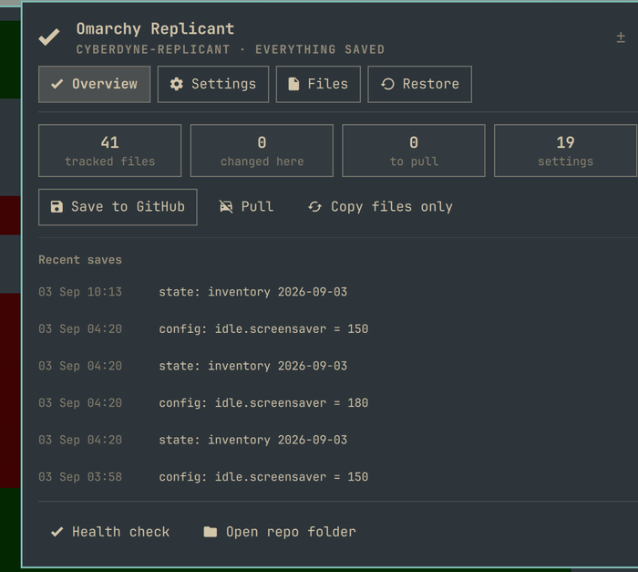
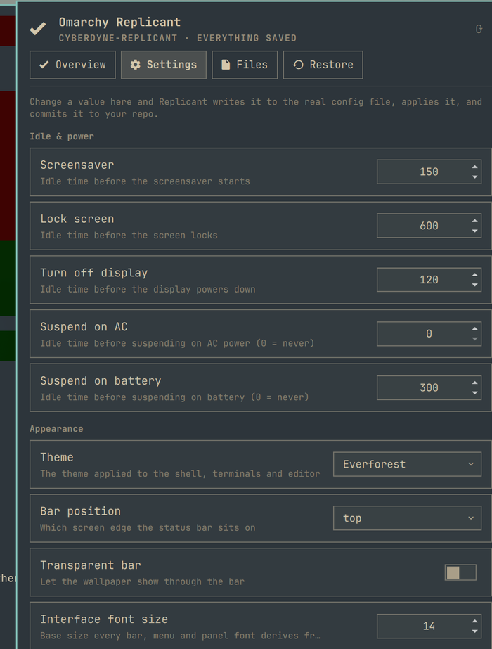

# Omarchy Replicant (`io.github.tymurbogach.omarchy-replicant`)

A bar widget for [Omarchy](https://omarchy.org/) that backs your machine up to **your own private
GitHub repo**, restores it on another machine, and lets you change the settings you actually
change — screensaver, theme, keyboard, bar — without opening a single config file.

<p align="center">
  
  &nbsp;
  
  &nbsp;
  
</p>

Click the **R** in the bar. One panel, four tabs:

| Tab | What it is for |
| --- | --- |
| **Overview** | What state this machine is in, one sentence on what to do next, and the buttons to do it. Recent saves. A health check. |
| **Settings** | 19 values across idle & power, appearance, input and defaults. Change one and it is written to the real config, applied, and committed to your repo. |
| **Files** | Every file being backed up, searchable and filterable, each showing whether it is untouched, changed, or already saved. Per-file edit / diff / save / reset. |
| **Restore** | The two different ways back, kept deliberately apart. Both preview first. |

Nothing opens a terminal you have to dismiss. Editing a file opens your editor; a diff renders in
the panel; a destructive action asks once, in the panel, and then just runs.

## Install

```bash
omarchy plugin add https://github.com/tymurbogach/omarchy-replicant --enable --yes
```

Then set up your private repo (see [GETTING-STARTED.md](GETTING-STARTED.md)):

```bash
omarchy-replicant login            # gh auth, once
omarchy-replicant create --push    # creates <hostname>-replicant, private, and pushes
```

On a second machine, point it at the repo you already have:

```bash
omarchy-replicant clone https://github.com/<you>/<hostname>-replicant
omarchy-replicant restore --dry-run    # see exactly what would change
omarchy-replicant restore --apply --all
```

## What you can change from the panel

| Group | Settings |
| --- | --- |
| **Idle & power** | Screensaver, lock screen, display off, suspend on AC, suspend on battery |
| **Appearance** | Theme, bar position, transparent bar, interface font size, interface density, bar thickness |
| **Input** | Key repeat rate and delay, keyboard layout, natural scrolling, tap to click, ignore touchpad while typing |
| **Defaults** | Default editor |

They live in four different formats — JSON (`shell.json`), TOML (`shell.toml`), Hyprland Lua
(`hypr/input.lua`) and a plain one-line state file — and the panel renders the right control for
each. A setting whose key is missing on this machine is shown greyed out rather than guessed at;
one that is still on the shell's built-in default is marked `(default)` and writing it creates the
key.

Hyprland gets a `hyprctl reload` after a write. `shell.json` and `shell.toml` need nothing: the
Omarchy shell watches both, so the change is visible before you let go of the control.

## What it tracks

- **`config/`** — a fixed, explicit list of dotfiles: shell, ssh, git, Hyprland Lua, terminals,
  Claude/opencode, VS Code, mise, Omarchy's own `shell.json` / `shell.toml`, the active theme's
  name and your default editor, plus systemd drop-ins under `/etc`.
- **`config/plugins/`** — auto-detected: any installed Omarchy plugin that keeps its settings in
  `~/.config/omarchy/<plugin>.json` is picked up with no configuration.
- **`secrets/`** — SSH keys, tokens and `.env` files, written `600`, scanned by a pre-commit hook
  that blocks a commit if anything credential-shaped leaks outside `secrets/`.
- **`state/`** — regenerated inventory: packages, enabled services, containers, and a diff of your
  `~/.config` against Omarchy's shipped defaults.

Your data repo is **private, one per user**, and separate from this plugin. This repo is only the
plugin's code.

## The three states

Each tracked file shows one badge:

| Badge | Meaning |
| --- | --- |
| ○ default | Byte-identical to Omarchy's shipped default — nothing of yours to lose |
| ● modified | Changed on this machine, not committed or not pushed yet |
| ◆ saved | Matches exactly what is in your GitHub repo |

## Safety

- Everything that writes to your system is **dry-run by default** (`restore`, `reset-all`).
- Any file that gets overwritten is copied to `<file>.bak.<epoch>` first, and the three most
  recent are kept per file so a run of small edits doesn't bury the config it is protecting.
- Destructive actions ask once, in the panel, before touching anything.
- Concurrent operations are serialized with a lock, so a burst of clicks can't corrupt the repo.
- The plugin refuses to create your data repo as public, and `doctor` tells you if one already
  exists as public.
- Reset is only offered for files Omarchy actually ships a default for — there is nothing to go
  back to otherwise.
- A Hyprland key that appears twice, or only inside a comment, is left alone rather than guessed
  at. These files decide whether the session starts.

## Commands

```
omarchy-replicant status [--json]        what this machine looks like vs the repo
omarchy-replicant savegame [-m "why"]    copy + commit + push
omarchy-replicant settings [--json]      every editable setting and its value
omarchy-replicant get <id>               read one setting   (e.g. idle.screensaver)
omarchy-replicant set <id> <value>       write one setting, apply it, and save it
omarchy-replicant edit|diff <id>         open in your editor / print a diff
omarchy-replicant save-file <id>         commit + push just that one file
omarchy-replicant path <id>              the real path an id refers to
omarchy-replicant log [-n N] [--json]    recent saves
omarchy-replicant doctor                 auth, remote privacy, hooks, permissions
omarchy-replicant reset <id>             one file -> Omarchy's default
omarchy-replicant reset-all              everything -> Omarchy defaults
omarchy-replicant restore --apply --all  everything -> what's saved on GitHub
omarchy-replicant clone <url>            set this machine up from an existing repo
```

The panel also takes the keyboard: `1`–`4` switch tabs, `/` jumps to the file filter, `r`
refreshes, `s` saves, `Esc` backs out.

## Development

```bash
./tests/run-all.sh    # 174 checks, plus shellcheck, qmllint and the manifest
```

The suites run against a throwaway `$HOME`, a fake `/usr/share/omarchy` and a real but temporary
git repo, so the sync states are driven for real rather than mocked, and the "this is a dry run"
claims are proven by hashing the tree before and after.

After changing any `.qml`, clear Quickshell's compiled-QML cache or you will be testing stale
code — see `CLAUDE.md`:

```bash
rm -rf ~/.cache/quickshell/qmlcache && omarchy restart shell
```

MIT licensed.
